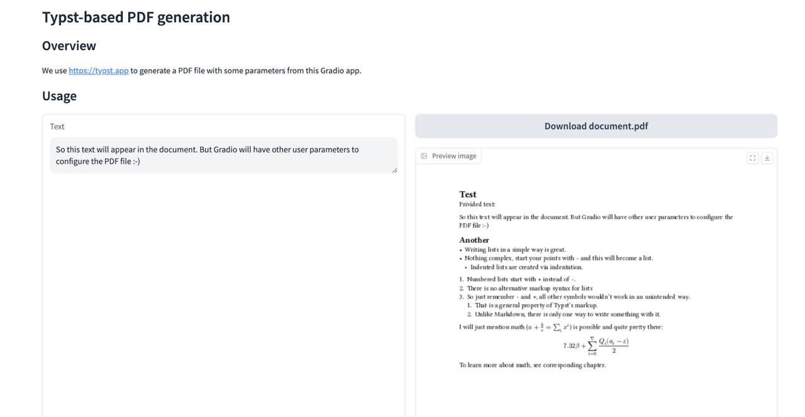

# Generate PDF documents using Gradio and Typst

- Jinja2 to template a Typst document
- Typst to generate a PDF document
- ImageMagick to get a preview image
- Gradio to provide a web interface with user parameters (via Components)
- Docker to run the app

## Demo



## Development

Install Python packages:

```
uv venv --python 3.12

source .venv/bin/activate

uv pip install -r requirements.txt
uv pip install -r requirements-dev.txt
```

## Run

Run Gradio app locally:

```
python app.py
```

## Production

Build the Docker image:

```
docker build -t pdf-generator-gradio .
```

Run:

```
docker run --rm -p 7860:7860 -it pdf-generator-gradio
```
