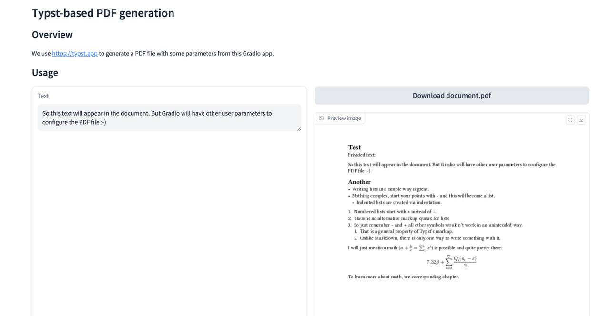

# Generate PDF documents using Gradio and Typst

- Jinja2 to template a Typst document
- Typst to generate a PDF document
- ImageMagick to get a preview image
- Gradio to provide a web interface with user parameters (via Components)
- Docker to run the app

## Demo



## Install

Clone the repository:

```
git clone https://github.com/egorsmkv/pdf-generator-gradio
cd pdf-generator-gradio
```

Install `typst`:

```
cargo install typst-cli
```

## Development

Create virtual environment and install dependencies:

```
uv venv --python 3.13

source .venv/bin/activate

uv pip install -r requirements.txt
uv pip install -r requirements-dev.txt
```

## Run

Run Gradio app locally:

```
export TYPST_BIN=/home/yehor/.cargo/bin/typst
export IMAGEMAGIC_BIN=/usr/bin/convert

gradio app.py
```

## Production

Build the Docker image:

```
docker build -t pdf-generator-gradio .
```

Run:

```
docker run --rm -p 7860:7860 -it pdf-generator-gradio
```
